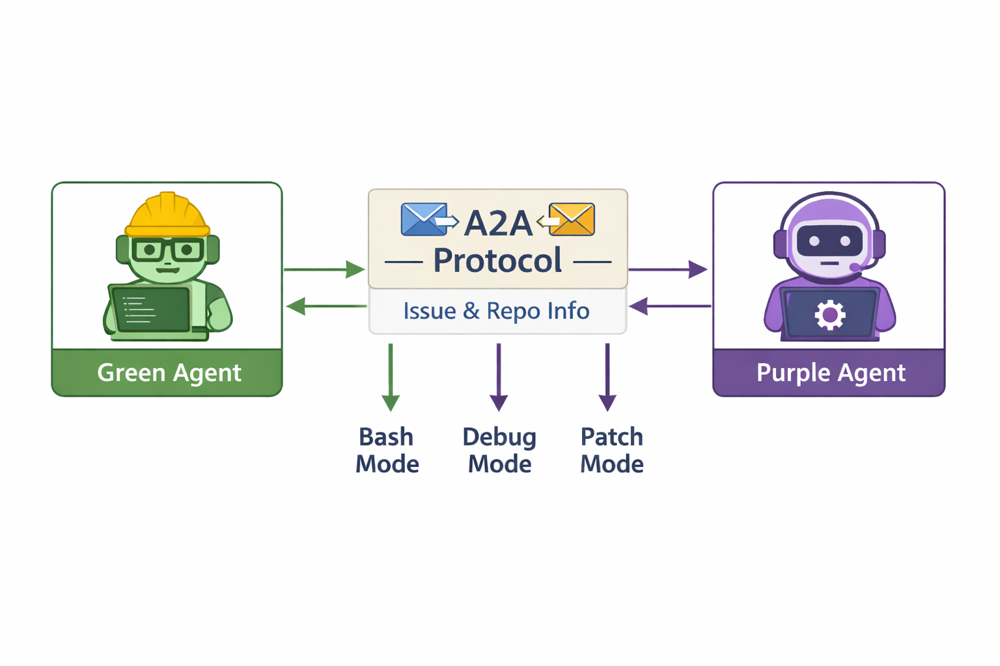
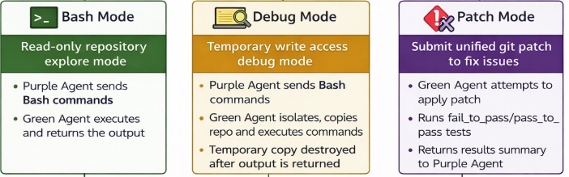

<h1 align="center">AgentSWE</h1>
<h3 align="center">Agentifying SWE-bench-Verified with A2A Protocol</h3>

<p align="center">
  <strong>Measure autonomous bug fixing through interactive repository exploration, mirroring a human developer workflow.</strong>
</p>

---

## TL;DR

**AgentSWE** re-architects SWE-bench-Verified as a multi-agent system using the **A2A (Agent-to-Agent) Protocol**. It separates orchestration (Green Agent) from reasoning (Purple Agent) through three controlled interaction modes, enabling fair evaluation of autonomous software engineering agents without coupling performance to custom tool implementations.

| Feature | Description |
|---------|-------------|
| **Clean Separation** | Green Agent orchestrates; Purple Agent reasons |
| **3 Interaction Modes** | Bash (read-only), Debug (ephemeral writes), Patch (final fix) |
| **No Custom Tools** | Standard bash/git only - measures bug-fixing, not tool mastery |
| **Token Efficiency** | First-class metric alongside resolution accuracy |

**[Watch the Demo Video](https://www.youtube.com/watch?v=Qvrz_tH8QZE)**

---

## AgentSWE at a Glance



### Core Design Principles

| Principle | Description |
|-----------|-------------|
| **Clean Separation of Concerns** | Green orchestrates execution; Purple handles reasoning |
| **3 Interactive Modes** | Controlled progression from exploration to solution |
| **No Extra Tools Needed** | Standard bash/git commands only |
| **Key Metrics** | Resolved Rate + Token Efficiency |

---

## Clean Separation of Concerns

```
┌──────────────────────────────────────────────────────────────────────────────────┐
│                           SEPARATION OF CONCERNS                                  │
├──────────────────────────────────┬───────────────────────────────────────────────┤
│          GREEN AGENT             │              PURPLE AGENT                      │
│          (Benchmark)             │              (Solver)                          │
├──────────────────────────────────┼───────────────────────────────────────────────┤
│                                  │                                               │
│  • Sends Issue Details and       │  • Handles Instruction Prompt and             │
│    required information via A2A  │    output format generated by the LLM         │
│                                  │                                               │
│  • Executes commands in          │  • Determines exploration strategy            │
│    isolated Docker containers    │                                               │
│                                  │  • Generates bash commands and                │
│  • Validates patches and         │    unified git patches                        │
│    runs test suites              │                                               │
│                                  │  • Makes all reasoning decisions              │
│  • Enforces security boundaries  │                                               │
│                                  │                                               │
└──────────────────────────────────┴───────────────────────────────────────────────┘
                                        │
                                        ▼
                    ┌───────────────────────────────────────┐
                    │  Both agents communicate via A2A      │
                    │  Artifacts - Deterministic Protocol   │
                    └───────────────────────────────────────┘
```

### Why This Matters

| Benefit | Description |
|---------|-------------|
| **Deterministic** | Same artifacts sent to all Purple Agents |
| **Fair Comparison** | Purple Agents evaluated on reasoning, not tool usage |
| **Reproducible** | Clear responsibility boundaries enable consistent results |

---

## Three Interactive Modes



### Mode Details

| Mode | Permission | Purpose | Example |
|------|------------|---------|---------|
| **Bash** | Read + Execute | Explore codebase | `find . -name '*.py' \| head -20` |
| **Debug** | Temp Write | Test fixes | `sed -i 's/bug/fix/' file.py && pytest` |
| **Patch** | Final Apply | Submit solution | `diff --git a/file.py b/file.py...` |

### Protocol Format

```json
// Bash Mode Request
{"action": "bash", "content": "grep -r 'error_handler' src/"}

// Debug Mode Request
{"action": "debug", "content": "echo 'print(x)' >> debug.py && python debug.py"}

// Patch Mode Request
{"action": "patch", "content": "diff --git a/file.py b/file.py\n-old\n+new"}
```

---

## No Extra Tools Needed

```
┌─────────────────────────────────────────────────────────────────────────────────┐
│                           NO EXTRA TOOLS NEEDED                                  │
├─────────────────────────────────────────────────────────────────────────────────┤
│                                                                                  │
│   Existing SWE-bench harnesses rely on custom tools, coupling performance       │
│   to tool-usage capabilities of the model.                                       │
│                                                                                  │
│   ┌─────────────────────────────────────────────────────────────────────────┐   │
│   │                                                                         │   │
│   │     AgentSWE measures BUG-FIXING ABILITY, not TOOL FLUENCY.            │   │
│   │                                                                         │   │
│   └─────────────────────────────────────────────────────────────────────────┘   │
│                                                                                  │
│   We eliminate custom tools and allow Purple Agent to use known bash and        │
│   git commands to both explore the repository and apply a fix in a friendly     │
│   way.                                                                           │
│                                                                                  │
└─────────────────────────────────────────────────────────────────────────────────┘
```

### Comparison

| Traditional Approach | AgentSWE Approach |
|---------------------|-------------------|
| Custom `search_code()` tool | `grep -r "pattern" .` |
| Bespoke `edit_file()` API | `git apply patch.diff` |
| Model-specific helpers | Universal bash/git commands |
| Requires tool training | Works with any LLM |

### Benefits

- **Fair Evaluation**: All models use the same interface
- **Interpretable**: Standard commands are easy to audit
- **Reproducible**: No hidden tool implementations
- **Transferable**: Skills apply to real-world development

---

## Key Metrics

```
┌─────────────────────────────────────────────────────────────────────────────────┐
│                               KEY METRICS                                        │
├─────────────────────────────────────────────────────────────────────────────────┤
│                                                                                  │
│   ┌─────────────────────────────────────────────────────────────────────────┐   │
│   │  A preferred agent is the purple agent that has a HIGH RESOLVED RATE    │   │
│   │  and requests FEWER NUMBER OF TOKENS                                     │   │
│   └─────────────────────────────────────────────────────────────────────────┘   │
│                                                                                  │
│   Hence, we track:                                                               │
│                                                                                  │
│   ┌─────────────────────────────────────────────────────────────────────────┐   │
│   │                                                                         │   │
│   │  • [From existing SweBench-verified] Resolved Rate at pass@1 and pass@3 │   │
│   │                                                                         │   │
│   │  • [New] # Tokens Requested: Total number of tokens requested by the    │   │
│   │         purple agent in bash and debug modes                            │   │
│   │                                                                         │   │
│   └─────────────────────────────────────────────────────────────────────────┘   │
│                                                                                  │
└─────────────────────────────────────────────────────────────────────────────────┘
```

### Metrics Table

| Metric | Source | Description |
|--------|--------|-------------|
| **Resolved Rate (pass@1)** | SWE-bench-Verified | % resolved on first attempt |
| **Resolved Rate (pass@3)** | SWE-bench-Verified | % resolved within 3 attempts |
| **# Tokens Requested** | **AgentSWE (New)** | Total tokens in bash/debug modes |
| **Avg Turns** | AgentSWE | Average conversation turns per task |
| **FAIL_TO_PASS** | SWE-bench | Tests that should fail before, pass after |
| **PASS_TO_PASS** | SWE-bench | Tests that should pass both before and after |

### Why Token Efficiency Matters

```
Token Usage → Cost + Speed + Reasoning Quality

Lower Tokens = Cheaper Evaluation
             = Faster Resolution
             = More Efficient Exploration
             = Better Understanding of Problem
```

---

## Quick Start

### Prerequisites

- Docker
- Python 3.9+
- [uv](https://docs.astral.sh/uv/) package manager

### Installation

```bash
# Clone the repository
git clone https://github.com/your-org/green-agent.git
cd green-agent

# Install dependencies
uv sync

# Run the Green Agent
uv run src/server.py
```

### Running with Docker

```bash
# Build the image
docker build -t agentswe-green .

# Run the container
docker run -p 9009:9009 agentswe-green
```

### Configuration

Send evaluation requests to the Green Agent:

```json
{
  "participants": {
    "solver": "http://purple-agent:9010/"
  },
  "config": {
    "instance_id": "django__django-11099",
    "max_turns": 10,
    "max_attempts": 3
  }
}
```

| Config Option | Default | Description |
|--------------|---------|-------------|
| `instance_id` | - | Specific task to evaluate |
| `repo` | - | Filter by repository |
| `max_tasks` | 1 | Number of tasks to evaluate |
| `max_turns` | 10 | Max conversation turns per task |
| `max_attempts` | 1 | Attempts per task (1=pass@1, 3=pass@3) |
| `bash_timeout` | 30s | Timeout per bash command |
| `task_timeout` | 600s | Overall timeout per task |

---

## Architecture Deep Dive

### Request Flow

```
┌────────────────────────────────────────────────────────────────────────────────┐
│                              REQUEST FLOW                                       │
└────────────────────────────────────────────────────────────────────────────────┘

  AgentBeats          Green Agent              Docker              Purple Agent
  Platform            (Orchestrator)           Container           (Solver)
      │                    │                      │                     │
      │  Eval Request      │                      │                     │
      │───────────────────►│                      │                     │
      │                    │                      │                     │
      │                    │  Start Container     │                     │
      │                    │─────────────────────►│                     │
      │                    │                      │                     │
      │                    │  Clone & Setup Repo  │                     │
      │                    │─────────────────────►│                     │
      │                    │                      │                     │
      │                    │        Task Data (A2A)                     │
      │                    │────────────────────────────────────────────►
      │                    │                      │                     │
      │                    │                      │    {"action": "bash", ...}
      │                    │◄────────────────────────────────────────────
      │                    │                      │                     │
      │                    │  Execute Command     │                     │
      │                    │─────────────────────►│                     │
      │                    │                      │                     │
      │                    │  Return Output       │                     │
      │                    │◄─────────────────────│                     │
      │                    │                      │                     │
      │                    │        Bash Result (A2A)                   │
      │                    │────────────────────────────────────────────►
      │                    │                      │                     │
      │                    │         ... (multiple turns) ...           │
      │                    │                      │                     │
      │                    │                      │    {"action": "patch", ...}
      │                    │◄────────────────────────────────────────────
      │                    │                      │                     │
      │                    │  Apply Patch         │                     │
      │                    │─────────────────────►│                     │
      │                    │                      │                     │
      │                    │  Run Tests           │                     │
      │                    │─────────────────────►│                     │
      │                    │                      │                     │
      │  Evaluation        │                      │                     │
      │  Results           │                      │                     │
      │◄───────────────────│                      │                     │
      │                    │                      │                     │
```

### Project Structure

```
green-agent/
├── src/
│   ├── server.py             # A2A server setup & agent card
│   ├── executor.py           # A2A request handling
│   ├── agent.py              # Core orchestration logic
│   ├── container_executor.py # Docker container management
│   ├── docker_validator.py   # Patch validation & test running
│   ├── swebench.py           # SWE-bench dataset loading
│   └── messenger.py          # A2A messaging utilities
├── docker/
│   └── Dockerfile.bash       # Container image for execution
├── tests/
│   └── test_agent.py         # Agent tests
├── docs/
│   └── images/               # Architecture diagrams
├── Dockerfile                # Main container image
├── pyproject.toml            # Python dependencies
└── README.md                 # This file
```

---

## Security Model

```
┌─────────────────────────────────────────────────────────────────────────────────┐
│                        DEFENSE-IN-DEPTH SECURITY                                 │
├─────────────────────────────────────────────────────────────────────────────────┤
│                                                                                  │
│   Layer 1: FILESYSTEM PERMISSIONS                                                │
│   └── OS-level read-only (chmod a-w) on repository                              │
│                                                                                  │
│   Layer 2: PATH BOUNDARIES                                                       │
│   └── Cannot cd outside /workspace/repo                                         │
│                                                                                  │
│   Layer 3: BLOCKED PATHS                                                         │
│   └── /tmp, /etc, /root, /home, /proc, /sys, /dev blocked                       │
│                                                                                  │
│   Layer 4: GIT RESTRICTIONS                                                      │
│   └── Cannot access commits after base_commit (no peeking at fix!)              │
│                                                                                  │
│   Layer 5: TEST PROTECTION                                                       │
│   └── Test files from test_patch are immutable                                  │
│                                                                                  │
│   Layer 6: CONTAINER ISOLATION                                                   │
│   └── Debug mode runs in ephemeral container snapshots                          │
│                                                                                  │
└─────────────────────────────────────────────────────────────────────────────────┘
```

| Security Layer | Mechanism | Purpose |
|---------------|-----------|---------|
| Filesystem | `chmod a-w` | Prevent unauthorized writes |
| Boundaries | Path validation | Contain execution to repo |
| Blocked Paths | Deny list | Protect system directories |
| Git Restrictions | Commit ancestry check | Prevent solution leakage |
| Test Protection | Immutable test files | Ensure fair evaluation |
| Isolation | Ephemeral containers | Safe experimentation |

---

## A2A Protocol Integration

AgentSWE is built on the [A2A Protocol](https://a2a-protocol.org/) for agent-to-agent communication:

```python
# Green Agent sends task data (raw issue info only)
task_message = {
    "cwd": "/workspace/repo",
    "problem_statement": "Bug description from GitHub issue...",
    "hints_text": "Relevant hints if available...",
    "python_version": "3.9",
    "fail_to_pass": ["tests/test_bug.py::test_specific_case"]
}

# Purple Agent responds with action
response = {
    "action": "bash",
    "content": "grep -r 'error_pattern' src/"
}

# Green Agent returns structured result
result = {
    "cwd": "/workspace/repo/src",
    "stdout": "src/handler.py:42: error_pattern found",
    "stderr": ""
}
```

---

## Example Evaluation Output

```
##############################################################
##############################################################
##  FINAL EVALUATION SUMMARY
##############################################################
Evaluation complete (pass@3):
- Tasks: 10 total, 8 validated, 1 no patch, 1 errors
- Tests: 47 passed, 3 failed
- Average score: 78.50%
- Resolve rate (pass@3): 70.00% (7/10 instances fully resolved)
- Average turns: 6.2
- Bash stdout chars: 125,432 total (12,543 avg per task)
##############################################################
##############################################################
```

---

## Contributing

We welcome contributions! Please see our contributing guidelines for:
- Code style requirements
- Testing procedures
- Pull request process

---

## License

This project is licensed under the **MIT License**. See [LICENSE](LICENSE) for details.

---

## Acknowledgments

- [SWE-bench](https://www.swebench.com/) for the benchmark dataset
- [A2A Protocol](https://a2a-protocol.org/) for agent communication standards
- [AgentBeats](https://agentbeats.dev) for the competition platform

---

<p align="center">
  <strong>AgentSWE - Agentifying SWE-bench-Verified</strong><br/>
  <em>Measuring what matters: Bug-fixing ability, not tool fluency.</em>
</p>
